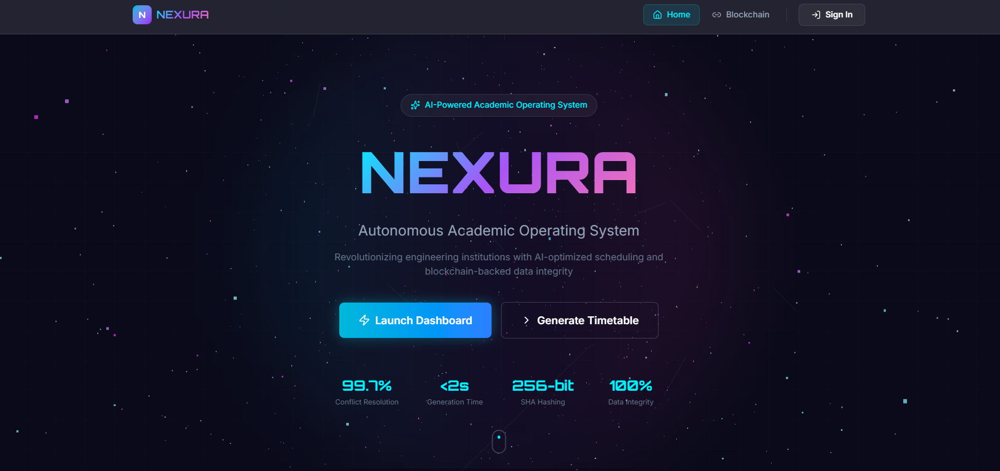
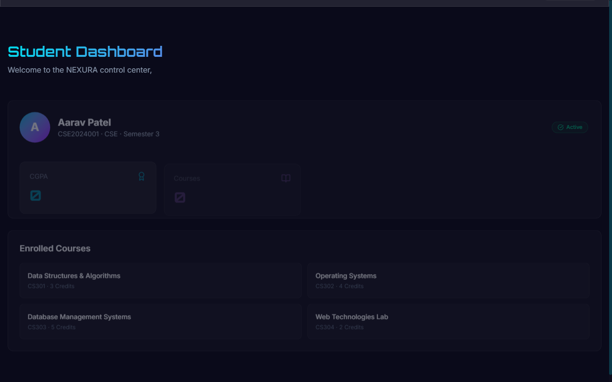
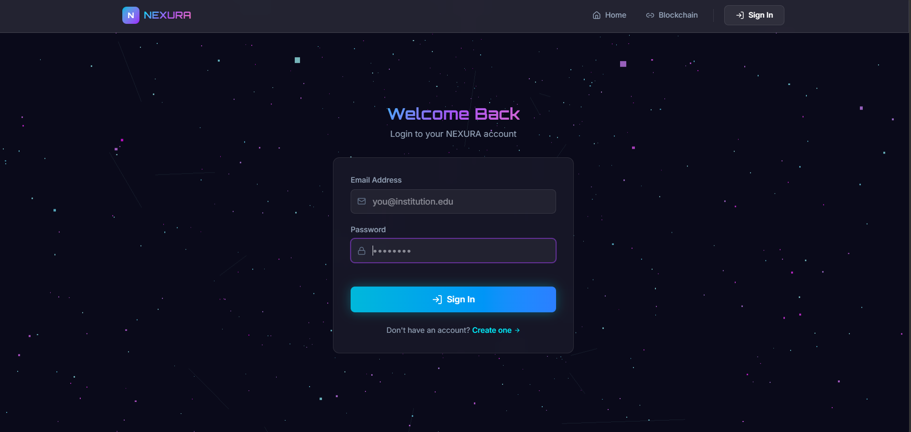
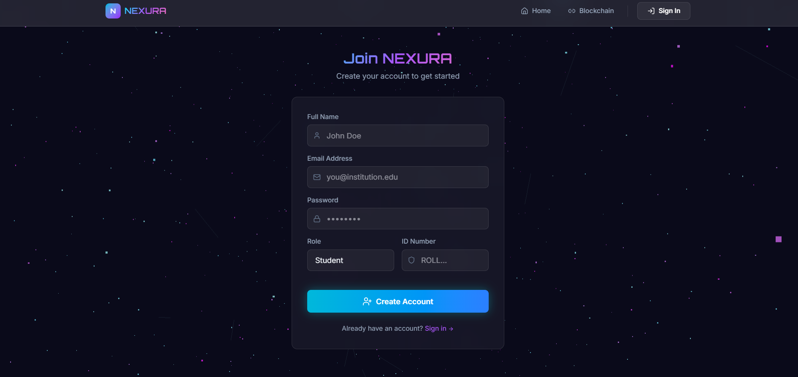
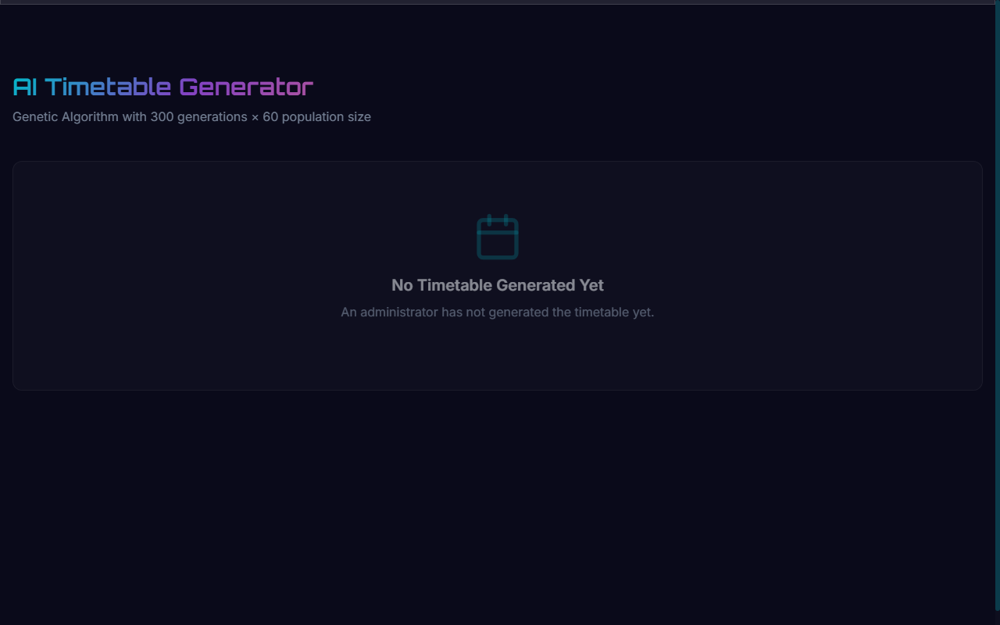
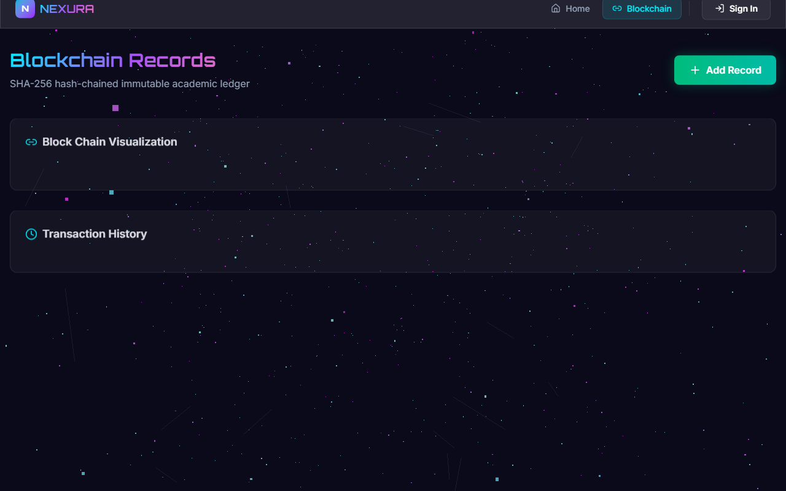
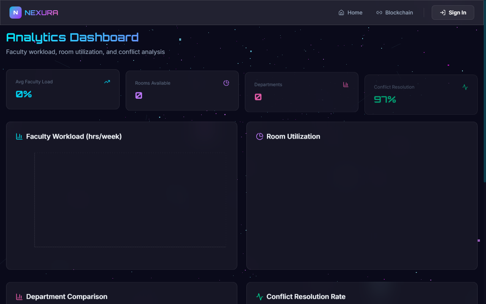

# NEXURA — AI + Blockchain Autonomous Academic Operating System

A visually stunning, full-stack web platform for academic scheduling and student lifecycle management, powered by AI optimization and blockchain-backed data integrity.


---

## Visual Preview

### Landing Page


### Admin & Student Dashboard


---

## Features

- **AI Timetable Generator** — Genetic Algorithm with 300 generations × 60 population
- **Blockchain Records** — SHA-256 hash-chained immutable academic ledger
- **Real-time Analytics** — Faculty workload, room utilization, conflict analysis
- **Stunning UI** — 3D particles, glassmorphism, neon glow, Framer Motion animations
- **Fully Responsive** — Mobile, tablet, and desktop optimized

---

## Step-by-Step Developer Setup Guide

Follow these steps to set up NEXURA on your local environment:

### 1. Prerequisites
Ensure you have the following installed on your machine:
* **Node.js** (v18.0.0 or higher, Node v20/v22 recommended)
* **npm** (v9.0.0 or higher)
* **MongoDB** (Local instance or MongoDB Atlas URL. Optional: Server will fall back to in-memory mode if unavailable)

---

### 2. Environment Variables Configuration

Copy the template environment configuration files and supply your local parameters:

#### For the Backend Server:
Navigate to the `server/` directory, copy `.env.example` to `.env` and adjust the variables if needed:
```bash
cd server
cp .env.example .env
```
#### For the Frontend Client:
Navigate to the `client/` directory, copy `.env.example` to `.env` and adjust the variables if needed:
```bash
cd client
cp .env.example .env
```

---

### 3. Backend Server Setup

1. Open a terminal and navigate to the `server` directory:
   ```bash
   cd server
   ```
2. Install the backend dependencies:
   ```bash
   npm install
   ```
3. Start the Express server in development mode:
   ```bash
   npm run dev
   ```
   The backend server will run on `http://localhost:5000`.

---

### 4. Frontend Client Setup

1. Open a new terminal and navigate to the `client` directory:
   ```bash
   cd client
   ```
2. Install the client dependencies:
   ```bash
   npm install
   ```
3. Start the Vite React development server:
   ```bash
   npm run dev
   ```
   The frontend application will run on `http://localhost:3000`.

---

### 5. Seeding Demo Database & Account Information

For testing and demonstration purposes, you can automatically seed the database and set up default accounts:
1. Launch both the backend and frontend.
2. To seed the database with students, courses, faculty, and transaction data, send a POST request to the demo setup endpoint:
   * **Linux/macOS:**
     ```bash
     curl -X POST http://localhost:5000/api/auth/demo-setup
     ```
   * **Windows (PowerShell):**
     ```powershell
     Invoke-RestMethod -Method Post -Uri "http://localhost:5000/api/auth/demo-setup"
     ```
3. The demo database setup generates the following pre-configured credentials (password is `demo123` for all):
   * **Admin View:** `admin@nexura.edu`
   * **Faculty View:** `faculty@nexura.edu`
   * **Student View:** `student@nexura.edu`

---

### 6. Interactive Demo Flow
1. Open your browser and navigate to `http://localhost:3000`.
2. Explore the interactive **Landing Page** with the 3D particle constellation background.
3. Sign in through the **Login Page** with one of the seeded credentials above.
4. Navigate to the **Timetable** generator and click **"Generate Timetable"** to run the Genetic Algorithm engine.
5. In the **Blockchain** view, inspect the SHA-256 block ledger and add a record to simulate transaction chains.
6. Check **Analytics** to view live charts of department average CGPA, room utilization, and fee collections.

---

## Environment Variables Directory

### Backend Server (`server/.env`)

| Variable Name | Required | Default Value | Description |
|---|---|---|---|
| `PORT` | No | `5000` | The port the Express application runs on. |
| `MONGODB_URI` | No | `mongodb://localhost:27017/nexura` | MongoDB connection URL. |
| `JWT_SECRET` | No | `nexura_super_secret_key_2026` | secret key used for signing session JWT tokens. |
| `EMAIL_USER` | No | `your_email@gmail.com` | SMTP username for verification email OTP service. |
| `EMAIL_PASS` | No | `your_gmail_app_password` | SMTP App password for OTP verification emails. |

### Frontend Client (`client/.env`)

| Variable Name | Required | Default Value | Description |
|---|---|---|---|
| `VITE_API_URL` | No | `/api` | The base backend URL for REST requests. Uses Vite dev server proxy. |

---

## Application Screenshots

Here are visual representations of the pages inside the NEXURA system:

| View | Screenshot |
|---|---|
| **Landing Screen** |  |
| **Login Screen** |  |
| **Signup Screen** |  |
| **Academic Dashboard** |  |
| **Timetable GA Generator** |  |
| **Blockchain Records Chain** |  |
| **Analytics Overview** |  |

---

## Project Structure

```
Nexura/
├── client/          # React + Vite Frontend
│   ├── src/
│   │   ├── components/   # UI, 3D, layout components
│   │   ├── pages/        # 7 main application pages
│   │   ├── hooks/        # Custom react hooks
│   │   ├── store/        # Zustand state store
│   │   └── lib/          # Axios API client
│   └── ...
├── server/          # Express Backend
│   ├── config/      # DB and SMTP configuration files
│   ├── models/      # Mongoose Schemas (User, Student, Faculty, etc.)
│   ├── routes/      # REST API endpoints (auth, timetable, analytics)
│   ├── services/    # Genetic Algorithm and Blockchain simulation engines
│   └── seed/        # Pre-seeded demo dataset
└── README.md
```

---

## API Endpoints

| Method | Endpoint | Description |
|---|---|---|
| POST | `/api/auth/signup` | Signup a new student/faculty account |
| POST | `/api/auth/verify-otp` | Verify email verification OTP |
| POST | `/api/auth/login` | Sign in to account |
| POST | `/api/auth/demo-setup` | Seed database with test dataset & demo profiles |
| POST | `/api/timetable/generate` | Generate timetable using GA engine |
| POST | `/api/timetable/simulate-change` | Regenerate timetable with constraints |
| GET | `/api/students` | List all students |
| GET | `/api/faculty` | List all faculty |
| GET | `/api/courses` | List all courses |
| GET | `/api/transactions` | Retrieve blockchain ledger chain |
| POST | `/api/transactions` | Add new record to blockchain |
| GET | `/api/analytics` | Retrieve student CGPA and fee analytics |

---

## Technology Specs

* **Frontend:** React 18, Vite 6, Tailwind CSS 4, Framer Motion, Three.js / React Three Fiber, Recharts, React Router v7
* **Backend:** Node.js 20, Express 4, Mongoose / MongoDB
* **AI Engine:** Custom Genetic Algorithm (population 60, 300 generations, tournament selection, uniform crossover, adaptive mutation)
* **Blockchain Ledger:** SHA-256 hash chain with proof-of-work mining simulator
