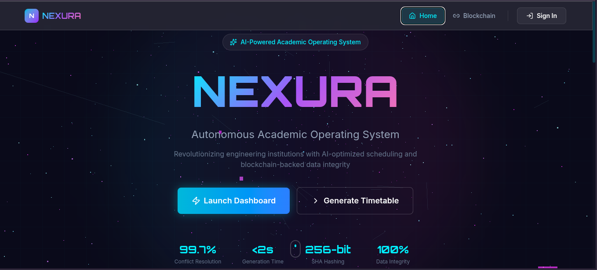
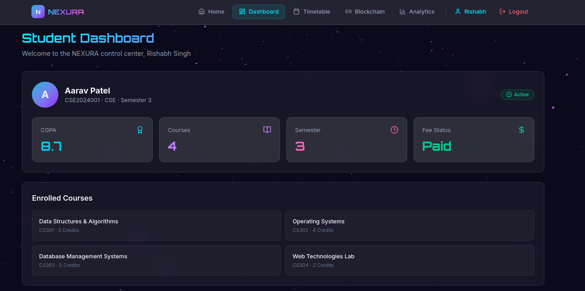
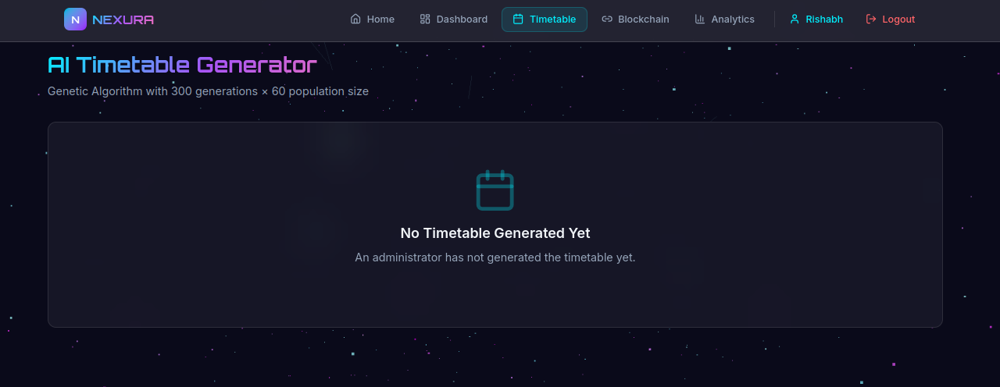
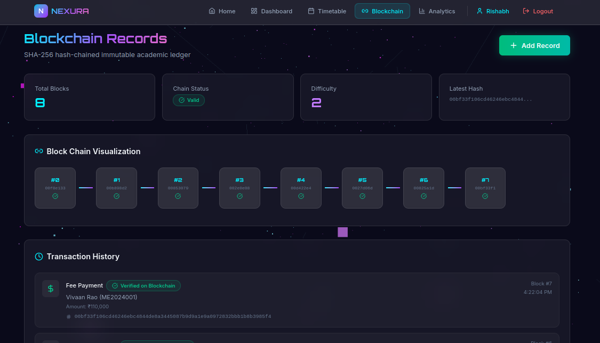
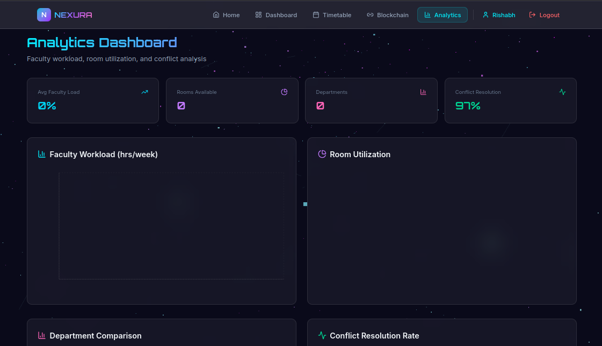

# NEXURA — AI + Blockchain Autonomous Academic Operating System

A visually stunning, full-stack web platform for academic scheduling and student lifecycle management, powered by AI optimization and blockchain-backed data integrity for better performance and efficiency .


## ✨ Features

- 🧠 **AI Timetable Generator** — Genetic Algorithm with 300 generations × 60 population
- 🔗 **Blockchain Records** — SHA-256 hash-chained immutable academic ledger
- 📊 **Real-time Analytics** — Faculty workload, room utilization, conflict analysis
- 🎨 **Stunning UI** — 3D particles, glassmorphism, neon glow, Framer Motion animations
- 📱 **Fully Responsive** — Mobile, tablet, and desktop optimized

## Screenshots

### Landing Page


### Dashboard


### Timetable Generation


### Blockchain Ledger


### Analytics



## 🚀 Quick Start

### Prerequisites
- Node.js 18+ 
- MongoDB (optional — runs with in-memory data if unavailable)

### 1. Start the Backend
```bash
cd server
npm install
npm run dev
```
Server starts on `http://localhost:5000`

### 2. Start the Frontend
```bash
cd client
npm install
npm run dev
```
Frontend starts on `http://localhost:3000`

### 3. Demo Flow
1. Visit `http://localhost:3000`
2. Explore the **Landing Page** with 3D particle background
3. Go to **Dashboard** → Switch between Admin/Student/Faculty views
4. Go to **Timetable** → Click **"Generate Timetable"** → See AI-generated schedule
5. Click **"Simulate Change"** → Mark faculty unavailable → **Regenerate**
6. Visit **Blockchain** → View transaction history → Click **"Add Record"**
7. Check **Analytics** → Faculty workload charts, room utilization

## 📁 Project Structure
```
NEXURA/
├── client/          # React + Vite Frontend
│   ├── src/
│   │   ├── components/   # UI, 3D, layout components
│   │   ├── pages/        # 5 main pages
│   │   ├── hooks/        # Custom hooks
│   │   └── lib/          # API client
│   └── ...
├── server/          # Express Backend
│   ├── models/      # Mongoose schemas
│   ├── routes/      # REST API endpoints
│   ├── services/    # GA engine, blockchain simulator
│   └── seed/        # Demo dataset
└── README.md
```

## 🔌 API Endpoints

| Method | Endpoint | Description |
|--------|----------|-------------|
| POST | `/api/timetable/generate` | Generate timetable via GA |
| POST | `/api/timetable/simulate-change` | Regenerate with constraints |
| GET | `/api/students` | List all students |
| GET | `/api/faculty` | List all faculty |
| GET | `/api/courses` | List all courses |
| GET | `/api/transactions` | Get blockchain chain |
| POST | `/api/transactions` | Add blockchain record |
| GET | `/api/analytics` | Get analytics data |

## 🛠️ Tech Stack

**Frontend:** React 18, Vite 6, Tailwind CSS 4, Framer Motion, Three.js / React Three Fiber, Recharts, React Router v7

**Backend:** Node.js 20, Express 4, Mongoose / MongoDB

**AI:** Custom Genetic Algorithm (population 60, 300 generations, tournament selection, uniform crossover, adaptive mutation)

**Blockchain:** Simulated SHA-256 hash chain with proof-of-work (difficulty 2)
## 🚀 Quick Start

### 📋 Prerequisites

Before running the project, make sure these are installed:

* Node.js (v18 or higher)
* npm
* MongoDB (Optional - the application can run with in-memory demo data if MongoDB is unavailable)

Verify installation:

```bash
node -v
npm -v
```

---

### 1️⃣ Clone the Repository

```bash
git clone https://github.com/<your-username>/NEXURA.git
cd NEXURA
```

---

### 2️⃣ Install Backend Dependencies

Open a terminal and run:

```bash
cd server
npm install
```

---

### 3️⃣ Install Frontend Dependencies

Open a new terminal and run:

```bash
cd client
npm install
```

---

### 4️⃣ Create Environment Variable Files

Create these files:

```text
server/.env
client/.env
```

---

### 5️⃣ Add the Following to `server/.env`

```env
PORT=5000

MONGODB_URI=mongodb://localhost:27017/nexura

JWT_SECRET=nexura_super_secret_key_2026

EMAIL_USER=your_email@gmail.com

EMAIL_PASS=your_email_app_password
```

---

### 6️⃣ Add the Following to `client/.env`

```env
VITE_API_URL=http://localhost:5000/api
```

---

### 7️⃣ Start the Backend

Inside the `server` folder:

```bash
npm run dev
```

Backend will run at:

```text
http://localhost:5000
```

Keep this terminal open.

---

### 8️⃣ Start the Frontend

Open a new terminal.

Inside the `client` folder:

```bash
npm run dev
```

Frontend will run at:

```text
http://localhost:3000
```

Keep this terminal open.

---

### 9️⃣ Open the Application

Open the following URL in your browser:

```text
http://localhost:3000
```
## 🔐 Environment Variables

Create a `.env` file in both `server/` and `client/` directories based on the examples below.

### Server (.env)
| Variable | Description | Example | Required |
|----------|-------------|---------|----------|
| PORT | Server port | `5000` | No (defaults to 5000) |
| MONGODB_URI | MongoDB connection string | `mongodb://localhost:27017/nexura` | No (defaults to local MongoDB) |
| JWT_SECRET | Secret for signing JWT tokens | `your_super_secret_key_here` | No (defaults to `nexura_super_secret_key_2026`) |
| EMAIL_USER | Email user for sending notifications (Gmail) | `your_email@gmail.com` | No (if not set, uses Ethereal test email) |
| EMAIL_PASS | Email password or app password | `your_email_password` | No (if not set, uses Ethereal test email) |

### Client (.env)
| Variable | Description | Example | Required |
|----------|-------------|---------|----------|
| VITE_API_URL | Base URL for API requests | `http://localhost:5000/api` | No (defaults to `/api` during development) |

## 🤝 Contributing

Please read [Contribution.md](Contribution.md) for details on our code of conduct and the process for submitting pull requests.

## 📄 License

This project is licensed under the MIT License - see the [LICENSE](LICENSE) file for details.
